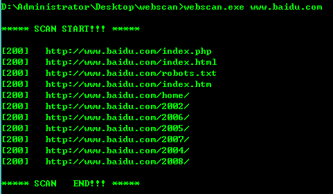

# Simple web scanner

一个基于python编写的简易网页扫描器，初步可以简单的扫描后台，或扫描某些网页是否存在，扫描结果保存在以扫描网址为名的txt文件中。

目前已完成多线程的操作，以及捕获了常见的异常
当线程不多的情况下，Ctrl+C完全可以中断操作，一般没有问题，如果线程过多，可能按完Ctrl+C后要稍微等一下

可以运行在python2或python3上，如有问题欢迎交流

其中windows平台上已经利用pyinstaller打包成了exe，zip包解压即用

使用方法：
> python webURL [-d SCANDICT] [-t THREADNUM] [-s SHOWCODE]

Example:
>python http://127.0.0.1 -d dict.txt -t 20 -s no 

可选项：

```
 -d SCANDICT, --dict SCANDICT
                       Dictionary for scanning, default is 'dict.txt'
 //扫描的辞典，自带的dict.txt是从御剑上复制的一个简单后台词典

 -t THREADNUM, --thread THREADNUM //线程数
                       the number of threads, default is 10

 -s SHOWCODE, --show SHOWCODE
                       Only output status_code 200 ?(yes/no) default is yes
 //是否显示非200状态的扫描结果，默认只显示200结果，-s no 可以显示所有结果（如404，302等）
 ```

运行示例：
>只显示status_code为200的运行测试



>显示所有status_code时的部分测试结果


